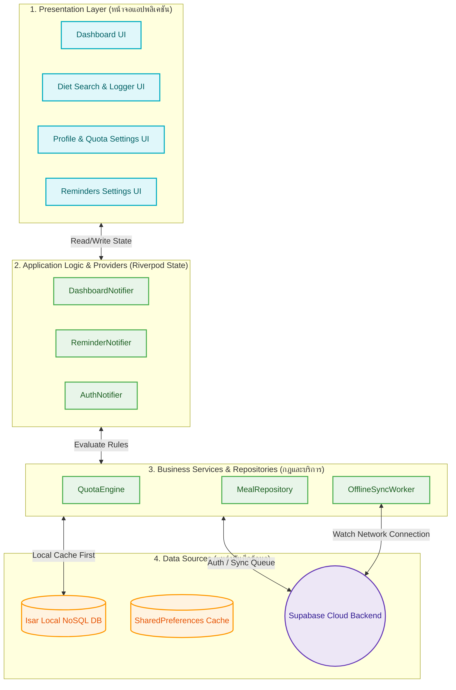
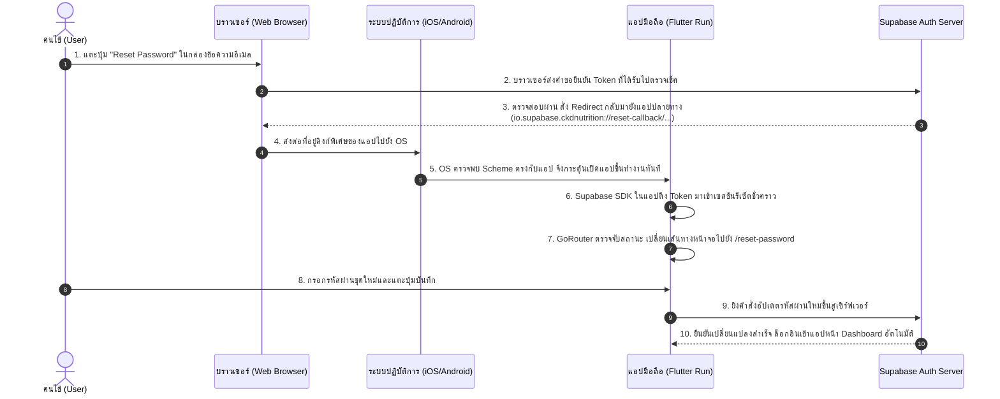

# 🛡️ CKD Nutrition Application
> **The Secure, Offline-First Diet & Water Intake Management Ecosystem for Chronic Kidney Disease (CKD) Patients**

[](https://flutter.dev)
[](https://dart.dev)
[](https://supabase.com)
[](https://isar.dev)
[](https://opensource.org/licenses/MIT)

แอปพลิเคชันนวัตกรรมควบคุมโภชนาการและติดตามสมดุลสารน้ำส่วนบุคคลสำหรับผู้ป่วยโรคไตเรื้อรัง (CKD) พัฒนาขึ้นด้วยสถาปัตยกรรม **Clean Layered Architecture** ผสานขีดความสามารถการจัดเก็บข้อมูลแบบ **Offline-First** และระบบรักษาความปลอดภัยระดับองค์กร เพื่อช่วยให้แพทย์ นักกำหนดอาหาร และผู้ป่วยสามารถควบคุมดูแลโปรตีน โซเดียม โพแทสเซียม น้ำตาล คาร์โบไฮเดรต และน้ำดื่ม ได้อย่างมีประสิทธิภาพสูงสุดบนโทรศัพท์มือถือทุกระบบ

---

## 🧭 System Architecture Diagram (ภาพรวมระบบย่อยสากล)

สถาปัตยกรรมแบ่งชั้นแยกความรับผิดชอบอย่างชัดเจน (Separation of Concerns) ทำให้แอปพลิเคชันตอบสนองได้อย่างรวดเร็วและสามารถดูแลรักษาโค้ดในระยะยาวได้ง่าย



---

## 🌟 Core Features Blueprint (รายละเอียด 12 ฟังก์ชันหลักของระบบ)

| ฟังก์ชันที่ | ชื่อคุณสมบัติหลัก (Feature Name) | รายละเอียดเชิงเทคนิคและการประมวลผล (Technical Details) |
| :---: | :--- | :--- |
| **1** | **Onboarding Welcome Screen** | หน้าแนะนำแอปเริ่มต้น บันทึกสถานะข้ามหน้าแนะนำลงหน่วยความจำถาวร `SharedPreferences` เพื่อไม่แสดงซ้ำในการเข้าใช้งานครั้งถัดไป |
| **2** | **Bilingual Secure Authentication** | ระบบลงทะเบียน/ล็อกอิน และเปลี่ยนรหัสผ่านผ่านระบบ Supabase Auth พร้อมจัดเก็บ JWT Access Token ในระบบรักษาความปลอดภัยฮาร์ดแวร์ระดับเครื่อง |
| **3** | **Medical Quota Calculation Engine** | ตรรกะประเมินโควต้าสารอาหารประจำวัน (โปรตีน โซเดียม โพแทสเซียม คาร์บ น้ำตาล และน้ำดื่ม) ผันแปรตามน้ำหนักตัวอ้างอิงและสถานะฟอกไต |
| **4** | **Master Food Search & Diet Logger** | ระบบพิมพ์ค้นหาข้อมูลอาหารแยก 8 หมวดหมู่โภชนาการ ดึงจากฐานข้อมูล Isar DB ในเครื่อง และบันทึกลง Daily Logs ภายในเวลาไม่ถึง 10 มิลลิวินาที |
| **5** | **Custom Food with Image Upload** | ฟังก์ชันเพิ่มอาหารทำเอง ระบุค่าโภชนาการ และอัปโหลดไฟล์ภาพถ่ายลงระบบ Supabase Storage พร้อมกลไกทำแคชภาพถ่ายภายในเครื่อง |
| **6** | **Quick Cup Water & Urine Logger** | ปุ่มลัดบันทึกปริมาณน้ำดื่มรายแก้วด่วน และระบบป้อนตัวเลขปริมาณน้ำปัสสาวะที่ตวงได้จริง เพื่อประเมินอัตราขับน้ำสะสมประจำวัน |
| **7** | **History Calendar Log Manager** | ปฏิทินย้อนประวัติการรับประทานรายวันย้อนหลังรายปี สามารถกดเลือกวันเพื่อดูรายละเอียดโภชนาการ และสั่งลบ (Delete) ประวัติทิ้งได้ |
| **8** | **Monthly Compliance Data Analytics** | ระบบวิเคราะห์อัตราความเข้มงวดในการควบคุมอาหารคนไข้ (Compliance Rate) แสดงผลผ่านกราฟแท่งเปรียบเทียบแนวโน้มโภชนาการแบบสวยงาม |
| **9** | **Push Notification Reminders** | ระบบตั้งค่าแจ้งเตือนดื่มน้ำ การกินยา หรือรอบการล้างไตผ่านทางหน้าท้อง ยิงการปลุกแบบ Push Notification ผ่าน SDK ของระบบปฏิบัติการ |
| **10** | **Offline-First Synchronization Sync** | กลไกความซิงค์ข้อมูลเบื้องหลังอัตโนมัติ โดยหากแอปออฟไลน์จะบันทึกคิวงานลงเครื่อง เมื่อสัญญาณเน็ตกลับมาจะกวาดคิวอัปโหลดซิงค์ทันที |
| **11** | **Time-Based 3-Food Recommendations** | ระบบสุ่มแนะนำ 3 เมนูอาหารโรคไตอัจฉริยะแบบแยกตามระยะโรค และช่วงชั่วโมงมื้ออาหาร (เช้า, กลางวัน, เย็น, ว่าง) พร้อมปุ่มบันทึกด่วน |
| **12** | **Fluid Balance Evaluation System** | หน้าจอประเมินสมดุลสารน้ำสะสมแบบสีแจ้งเตือน (สีฟ้าปกติ / สีแดงอันตราย) เพื่อความปลอดภัยสูงสุดของผู้ป่วยไม่ให้เกิดภาวะน้ำท่วมปอด |

---

## 🧠 Medical Quota Rules & Logic (ตรรกะประเมินทางการแพทย์อย่างละเอียด)

แอปพลิเคชันใช้ตรรกะการประมวลผลคำนวณโควต้าอาหารและน้ำดื่มที่อ้างอิงจาก **สมาคมโรคไตแห่งประเทศไทย** เป็นตัวประเมินผล:

### 1. การหาน้ำหนักตัวอ้างอิง (Ideal Body Weight - IBW)
ระบบไม่ใช้น้ำหนักตัวจริงในการคำนวณโควต้าโปรตีนเพื่อป้องกันข้อผิดพลาดในผู้ป่วยที่มีภาวะบวมน้ำ (Edema) แต่จะใช้สูตรดังนี้:
* **เพศชาย:** 
  $$\text{IBW (kg)} = \text{ส่วนสูง (cm)} - 100$$
* **เพศหญิง:** 
  $$\text{IBW (kg)} = \text{ส่วนสูง (cm)} - 105$$

### 2. เกณฑ์เป้าหมายสารอาหารต่อวัน (Daily Nutrients Limits)
ระบบจะทำการจับคู่ระยะของโรคไต (eGFR Stage 1 - 5) และสถานะการฟอกไต เพื่อคำนวณโควต้า:

$$\text{โควต้าโปรตีน (กรัม/วัน)} = \text{IBW (kg)} \times \text{ตัวคูณโปรตีน}$$

* **ตัวคูณโปรตีน (Protein Coefficient):**
  * **ก่อนฟอกไต (Stage 1 - 5):** ใช้ตัวคูณ **0.6 g/kg/day** (เพื่อลดของเสียและประคองไม่ให้ไตเสื่อมไปถึงระยะสุดท้าย)
  * **ฟอกไตแล้ว (ฟอกเลือดด้วยเครื่อง HD / ล้างช่องท้อง PD):** ใช้ตัวคูณ **1.2 g/kg/day** (เพื่อชดเชยสารอาหารโปรตีนที่สูญเสียไปขณะฟอกไต)
* **เกณฑ์เกลือแร่สะสมประจำวัน (Minerals Baseline):**
  * **โซเดียม (Sodium):** $< 2000\,\text{mg/day}$ ทุกระยะโรคไต
  * **โพแทสเซียม (Potassium):** 
    * ระยะ 1 - 2: ไม่จำกัด (ขึ้นกับผลเลือด)
    * ระยะ 3a - 5: $< 2000\,\text{mg/day}$ (เพื่อป้องกันกล้ามเนื้อหัวใจเต้นผิดจังหวะ)
  * **น้ำตาล (Sugar):** $< 24\,\text{g/day}$ ทุกระยะ
  * **คาร์โบไฮเดรต (Carbohydrate):** $\text{IBW} \times 4.5\,\text{g/day}$

---

## ⚡ Offline-First Synchronization Protocol (กลไกซิงค์ออฟไลน์คิวงาน)

การสื่อสารและประสานระหว่าง Isar DB กับ Supabase Cloud ใช้กลไกควบคุมแบบ **FIFO (First-In, First-Out Queue)** ร่วมกับตัวควบคุมความพยายามใหม่ (Retry Policy):

```text
[กดปุ่มบันทึกในแอป] ➔ [เขียนประวัติทับ Isar DB ทันทีเพื่อความเร็ว]
                         │
                         ▼
             [ตรวจสัญญาณเน็ตในเครื่อง?]
             ├── (มีอินเทอร์เน็ต) ➔ ยิง API อัปเดตข้อมูลขึ้น Supabase ➔ [เสร็จสิ้น]
             └── (ไม่มีเน็ต/ออฟไลน์) 
                         │
                         ▼
             [บันทึก Payload JSON ลงตาราง Isar OfflineAction ( FIFO )]
                         │
                         ▼
             [เปิด Network Connectivity Listener เฝ้ารอเน็ตกลับมา]
                         │
                         ▼
             (เน็ตกลับมาต่อสำเร็จ) ➔ ทยอยดึงคิวเก่าสุดส่งขึ้น Supabase ทีละรายการ
                         │
             [ซิงค์สำเร็จ?]
             ├── ใช่ ➔ ลบรายการแถวคิวนั้นออกจาก Isar DB ➔ ประมวลคิวตัวถัดไป
             └── ไม่สำเร็จ ➔ บวก Retry Count +1 (ขีดจำกัด 5 ครั้ง) ➔ ข้ามไปทำรายการถัดไปก่อน
```

---

## 🔑 Deep Link Auth Recovery Loop (ระบบกู้คืนและรีเซ็ตรหัสผ่าน)

เมื่อกดรีเซ็ตรหัสผ่านผ่านกล่องจดหมายอีเมล ระบบจะยืนยัน Token และเปลี่ยนผ่านสิทธิ์ไปหน้าจอตั้งรหัสใหม่โดยอัตโนมัติ:



---

## 🗄️ Database Schemas Map (โครงสร้างตารางข้อมูลที่เปิดใช้งานจริง)

แอปพลิเคชันรองรับ RLS Policies (Row Level Security) ทุกตาราง โดยข้อมูลผู้ใช้ทั้งหมดจะถูกผูกเข้ากับ `auth.uid() = user_id` ของเจ้าของบัญชีเท่านั้น:

### 1. ตารางข้อมูลประวัติคนไข้ (`user_health_profiles`)
*เก็บข้อมูลเป้าหมายสุขภาพตามเกณฑ์ที่คนไข้เลือก*
* `user_id` (uuid, PRIMARY KEY) ➔ ไอดีอ้างอิงจาก Supabase Auth
* `ckd_stage` (text) ➔ ระยะของโรคไต เช่น `stage_3b`, `stage_5`
* `gender` (text) ➔ เพศ (`male` / `female`)
* `weight_kg` (numeric) ➔ น้ำหนักตัวจริงของคนไข้
* `height_cm` (numeric) ➔ ส่วนสูงของคนไข้
* `avatar_id` (integer) ➔ ไอดีรูปโปรไฟล์ที่เลือกใช้งาน
* `age` (integer) ➔ อายุจริงของผู้ป่วย
* `egfr` (numeric) ➔ ค่าการทำงานของไตล่าสุด
* `is_on_dialysis` (boolean) ➔ สถานะการฟอกไต

### 2. ตารางบันทึกสารอาหารสะสมรายวัน (`daily_logs`)
*เก็บยอดรวมสะสมแบบอัปเดตทับเพื่อความรวดเร็วในการโหลด*
* `id` (uuid, PRIMARY KEY) ➔ ไอดีของประวัติวันนั้น ๆ
* `user_id` (uuid) ➔ ไอดีเจ้าของประวัติ
* `log_date` (date) ➔ วันที่ของสถิติ เช่น `2026-07-22`
* `total_protein_g` (numeric) ➔ ยอดรวมโปรตีนที่ทานไปของวัน
* `total_potassium_mg` (numeric) ➔ ยอดรวมโพแทสเซียมสะสม
* `total_sodium_mg` (numeric) ➔ ยอดรวมโซเดียมสะสม
* `total_sugar_g` (numeric) ➔ ยอดรวมน้ำตาลสะสม
* `total_carb_g` (numeric) ➔ ยอดรวมคาร์โบไฮเดรตสะสม
* `total_water_ml` (numeric) ➔ ยอดรวมปริมาณน้ำดื่มสะสม
* `total_urine_ml` (numeric) ➔ ยอดรวมปริมาณปัสสาวะที่ขับถ่ายสะสม

### 3. ตารางข้อมูลมื้อย่อยรายมื้อ (`meals`)
*เก็บประวัติแบบแยกรายมื้อเพื่อใช้ในการดูรายละเอียดและสั่งลบย้อนหลัง*
* `id` (uuid, PRIMARY KEY)
* `log_id` (uuid) ➔ คีย์เชื่อมโยงไปยังหัวตาราง `daily_logs`
* `food_id` (text) ➔ รหัสเมนูอาหารอ้างอิง
* `food_name` (text) ➔ ชื่อเมนูอาหารที่ทาน
* `quantity_g` (numeric) ➔ ปริมาณน้ำหนักกรัมของอาหาร
* `meal_type` (text) ➔ ช่วงมื้ออาหาร (`breakfast`, `lunch`, `dinner`, `snack`)
* `protein_g` (numeric) ➔ ปริมาณโปรตีนที่ได้รับจากจานนี้
* `potassium_mg` (numeric) ➔ ปริมาณโพแทสเซียมที่ได้รับ
* `sodium_mg` (numeric) ➔ ปริมาณโซเดียมที่ได้รับ
* `sugar_g` (numeric) ➔ ปริมาณน้ำตาลที่ได้รับ
* `carb_g` (numeric) ➔ ปริมาณคาร์โบไฮเดรตที่ได้รับ
* `water_ml` (numeric) ➔ ปริมาณน้ำแฝง/น้ำเปล่าที่ได้รับ

---

## 🛠️ Installation & Setup (คำแนะนำสำหรับการรันโครงการต่อ)

### 1. ติดตั้งซอฟต์แวร์ที่เกี่ยวข้อง
* ติดตั้ง **Flutter SDK** รุ่น `v3.22.0` ขึ้นไป
* ดำเนินการเปิดจำลอง Android Emulator หรือเครื่อง iOS จริงที่มีการเชื่อมต่อโปรไฟล์การพัฒนาของ Apple (Developer Profile)

### 2. ดาวน์โหลดโปรเจกต์และสร้างตัวแปลฐานข้อมูล Isar (สำคัญ 🌟)
เมื่อดึงโค้ดลงมาในเครื่องแล้ว ต้องทำการบิวต์สร้างคลาสฐานข้อมูล Local Cache ของ Isar ก่อนเสมอ ด้วยคำสั่งดังนี้:
```bash
# 1. โหลดแพ็กเกจที่ใช้งานทั้งหมดในเครื่อง
flutter pub get

# 2. บิวต์สร้างคลาสและออบเจกต์ฐานข้อมูลในเครื่องอัตโนมัติ
flutter pub run build_runner build --delete-conflicting-outputs
```

### 3. สั่งทดสอบการรันแอปพลิเคชัน
```bash
# สั่งรันแอปบนอุปกรณ์จำลองที่กำลังเชื่อมต่ออยู่
flutter run
```

---

## 📂 Project Architecture Map (แผนที่การเก็บรวบรวมไฟล์หลัก)

```text
lib/
├── core/             # คอนฟิกหลักและตัวจัดการฟังก์ชันตอบกลับระบบ (Result Type & Constants)
├── l10n/             # ระบบคำแปลรองรับ 2 ภาษาหลัก ( Bilingul Localization TH / EN )
├── models/           # ไฟล์กำหนดคลาสฐานข้อมูล Isar DB และคลาส JSON ของ Supabase
├── pages/            # ส่วนควบคุม UI หน้าจอทั้งหมด ( Dashboard, Profile, Reminders )
├── providers/        # ตัวกลางจัดหาและจัดการสถานะ ( Riverpod Providers & Controllers )
├── repositories/     # ตัวกรองแยกเส้นทางข้อมูล ( local cache vs. supabase data repos )
├── router/           # ระบบนำทางและคุมความปลอดภัยสิทธิ์การเข้าถึงหน้าจอ ( GoRouter Config )
├── services/         # ฟังก์ชันการทำงานทางการแพทย์และระบบซิงค์ ( Quota Engine & Sync Worker )
└── widgets/          # ชิ้นส่วนปุ่มหรือแถบข้อมูลที่ใช้ซ้ำในหน้าจอทั่วไป ( UI Core Custom Components )
```

---
**© 2026 CKD Nutrition Team. Designed for Medical Excellence and Data Sovereignty.**