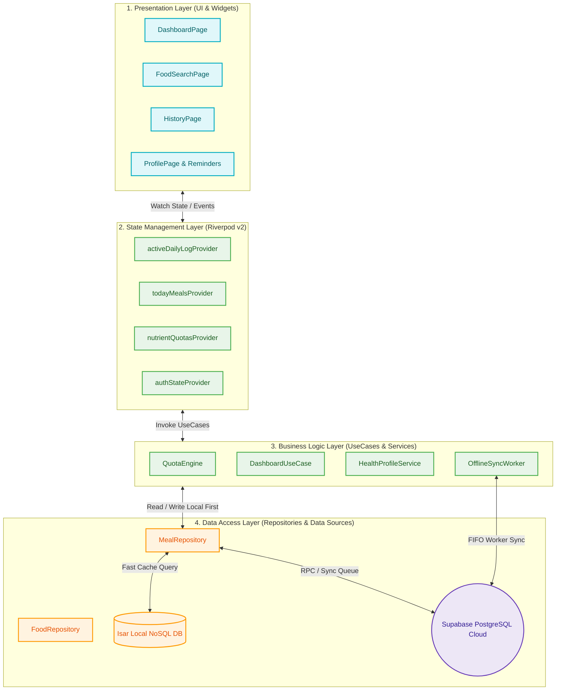

# 🛡️ CKD Nutrition Application (กินดีไตดี)
> **The Secure, Offline-First Medical Nutrition & Fluid Balance Management Ecosystem for Chronic Kidney Disease (CKD) Patients**

[](https://flutter.dev)
[](https://dart.dev)
[](https://riverpod.dev)
[](https://supabase.com)
[](https://isar.dev)
[](https://github.com/xhm-stk/CKD_Nutrition/actions)
[](https://opensource.org/licenses/MIT)

---

## 📖 บทนำและภาพรวมโปรเจกต์ (Project Overview)

**กินดีไตดี (CKD Nutrition Application)** คือแอปพลิเคชันทางการแพทย์บนมือถือและคอมพิวเตอร์ (Android, iOS, Windows) ที่พัฒนาขึ้นด้วยเฟรมเวิร์ก **Flutter (Dart)** เพื่อช่วยเหลือผู้ป่วยโรคไตเรื้อรัง (Chronic Kidney Disease: CKD) ตั้งแต่ระยะ 1 ถึง 5 รวมถึงผู้ป่วยที่ต้องฟอกเลือดด้วยเครื่องไตเทียม (Hemodialysis) และล้างไตทางหน้าท้อง (Peritoneal Dialysis) ให้สามารถติดตาม บันทึก และคำนวณสารอาหารหลัก 7 ชนิดและสภาวะสมดุลน้ำดื่มได้อย่างถูกต้องตามหลักเวชปฏิบัติ **KDIGO Guidelines**

แอปพลิเคชันถูกออกแบบด้วยสถาปัตยกรรม **Clean Layered Architecture** ผสานขีดความสามารถการจัดเก็บข้อมูลแบบ **Offline-First (Isar NoSQL)** และระบบซิงค์คิวอัตโนมัติ (**FIFO Sync Worker**) ไปยังคลาวด์ **Supabase PostgreSQL** ช่วยให้คนไข้และผู้ดูแลใช้งานได้อย่างราบรื่นแม้ในพื้นที่ไม่มีสัญญาณอินเทอร์เน็ต

---

## 🧭 สถาปัตยกรรมระบบ (System Architecture & Technology Stack)

### 1. ภาพรวมสถาปัตยกรรม 4 ชั้น (Clean Layered Architecture)


```mermaid
graph TD
    classDef ui fill:#e0f7fa,stroke:#00acc1,stroke-width:2px,color:#006064;
    classDef logic fill:#e8f5e9,stroke:#4caf50,stroke-width:2px,color:#1b5e20;
    classDef cache fill:#fff3e0,stroke:#ff9800,stroke-width:2px,color:#e65100;
    classDef cloud fill:#ede7f6,stroke:#673ab7,stroke-width:2px,color:#311b92;

    subgraph UI_Layer ["1. Presentation Layer (UI & Widgets)"]
        A[DashboardPage]:::ui
        B[FoodSearchPage]:::ui
        C[HistoryPage]:::ui
        D[ProfilePage & Reminders]:::ui
    end

    subgraph Controller_Layer ["2. State Management Layer (Riverpod v2)"]
        E[activeDailyLogProvider]:::logic
        F[todayMealsProvider]:::logic
        G[nutrientQuotasProvider]:::logic
        H[authStateProvider]:::logic
    end

    subgraph Domain_Services ["3. Business Logic Layer (UseCases & Services)"]
        I[QuotaEngine]:::logic
        J[DashboardUseCase]:::logic
        K[HealthProfileService]:::logic
        L[OfflineSyncWorker]:::logic
    end

    subgraph Storage_Layer ["4. Data Access Layer (Repositories & Data Sources)"]
        M[MealRepository]:::cache
        N[FoodRepository]:::cache
        O[(Isar Local NoSQL DB)]:::cache
        P((Supabase PostgreSQL Cloud)):::cloud
    end

    UI_Layer <-->|Watch State / Events| Controller_Layer
    Controller_Layer <-->|Invoke UseCases| Domain_Services
    Domain_Services <-->|Read / Write Local First| M
    M <-->|Fast Cache Query| O
    M <-->|RPC / Sync Queue| P
    L <-->|FIFO Worker Sync| P
```

### 2. สรุปเทคโนโลยีที่ใช้ (Tech Stack Summary)

* **Frontend Framework:** Flutter 3.22+ (Dart 3.4+) — Single codebase สำหรับ Android, iOS, Windows
* **State Management:** Flutter Riverpod v2.5+ (`StateNotifierProvider`, `StreamProvider`, `Provider`)
* **Local Database (Offline Cache):** Isar NoSQL Database (High-performance fast NoSQL engine)
* **Backend & Cloud Database:** Supabase (PostgreSQL 15+, Auth, Storage, Realtime, RPC Functions)
* **Local Data Persistence:** SharedPreferences (สำหรับเก็บค่าสวิตช์ตั้งค่าและสภาวะ Theme)
* **Local Security:** `local_auth` (Biometrics: Face ID / Touch ID / Fingerprint) & AES-256 Local Storage Encryption
* **Local Notifications:** `flutter_local_notifications` (ระบบตั้งเวลาเตือนกินยา จิบน้ำ บันทึกอาหาร)
* **Navigation:** `go_router` (ระบบเปลี่ยนหน้าพร้อม Auth & Profile Setup Guards)

---

## ⚡ สถาปัตยกรรมทำงานออฟไลน์ (Offline-First Synchronization Engine)

แอปพลิเคชันใช้อุปกรณ์มือถือเป็น **Single Source of Truth** ชั่วคราวขณะใช้งาน โดยมีลำดับขั้นตอนดังนี้:

```text
[กดปุ่มบันทึกมื้ออาหาร / น้ำดื่ม / ปัสสาวะ]
                 │
                 ▼
     [เขียนข้อมูลลง Isar Local DB ทันที] ───► [อัปเดตหน้าจอ UI ทันที (Zero Latency)]
                 │
       [ตรวจจับสัญญาณอินเทอร์เน็ต]
        ├── (มีอินเทอร์เน็ต) ➔ เรียก Supabase RPC (`log_meal_v2`) ➔ [เสร็จสมบูรณ์]
        └── (ไม่มีอินเทอร์เน็ต / ออฟไลน์)
                 │
                 ▼
     [แปลง Payload เป็น OfflineAction บันทึกลงคิว Isar DB]
                 │
                 ▼
     [เปิด Connectivity Listener รอสัญญาณเน็ตกลับมา]
                 │
                 ▼
     (เมื่อเชื่อมต่อเน็ตสำเร็จ) ➔ OfflineSyncWorker กวาดคิวตามลำดับเวลา (FIFO) ส่งขึ้น Supabase RPC
                 │
     [ผลลัพธ์ซิงค์สำเร็จ?]
     ├── ใช่ ➔ ลบรายการคิวนั้นออกจาก Isar Local DB
     └── ไม่สำเร็จ ➔ เพิ่ม Retry Count +1 และทดลองใหม่ในรอบถัดไป
```

---

## 🩺 เกณฑ์คำนวณทางการแพทย์ (Medical Quota Rules & Logic)

ตรรกะประเมินโควต้าสารอาหาร 7 ชนิดหลักอ้างอิงตามแนวทางเวชปฏิบัติ **KDIGO Guidelines** และสมาคมโรคไตแห่งประเทศไทย:

### 1. การคำนวณน้ำหนักตัวตามเกณฑ์ (Ideal Body Weight - IBW)
เพื่อป้องกันข้อผิดพลาดในผู้ป่วยที่มีภาวะบวมน้ำ (Edema) ระบบใช้น้ำหนักมาตรฐานคำนวณโควต้าโปรตีน:
* **ชาย:** $\text{IBW (kg)} = \text{ส่วนสูง (cm)} - 100$
* **หญิง:** $\text{IBW (kg)} = \text{ส่วนสูง (cm)} - 105$
* *หมายเหตุ:* หากน้ำหนักจริงต่างจาก IBW เกิน $\pm 20\%$ ระบบจะใช้น้ำหนักปรับแต่ง (Adjusted Body Weight: aBW):
$$\text{aBW} = \text{IBW} + 0.25 \times (\text{Actual Weight} - \text{IBW})$$

### 2. เกณฑ์โควต้าสารอาหารประจำวัน (Daily Nutrients Quota Limits)

$$\text{โควต้าโปรตีน (กรัม/วัน)} = \text{IBW (kg)} \times \text{ตัวคูณโปรตีน}$$

* **ตัวคูณโปรตีน (Protein Coefficient):**
  * **ก่อนฟอกไต (Stage 1 - 5 Non-dialysis):** **0.6 - 0.8 g/kg/day** (Low Protein Diet เพื่อลดการเกิดของเสีย BUN คั่ง)
  * **ฟอกไตแล้ว (Hemodialysis HD / Peritoneal Dialysis PD):** **1.2 - 1.3 g/kg/day** (เพิ่มโปรตีนชดเชยการสูญเสียในสายฟอก)
* **เกณฑ์เกลือแร่และสารอาหารอื่น:**
  * **โซเดียม (Sodium):** $< 2,000\,\text{mg/day}$ ทุกระยะโรคไต (ลดภาวะบวมน้ำและความดันสูง)
  * **โพแทสเซียม (Potassium):** $< 1,500 - 2,000\,\text{mg/day}$ ใน Stage 3b-5 (ป้องกันหัวใจเต้นผิดจังหวะ Hyperkalemia)
  * **ฟอสฟอรัส (Phosphorus):** $< 800 - 1,000\,\text{mg/day}$ ใน Stage 3b-5 (ป้องกันโรคกระดูกเปราะและคราบแคลเซียมเกาะเส้นเลือด)
  * **สมดุลน้ำดื่มไดนามิก (Dynamic Fluid Balance):**ในผู้ป่วย Stage 4-5 ที่ขับปัสสาวะได้ลดลง:
    $$\text{โควต้าน้ำดื่ม (mL/วัน)} = \text{ปริมาณปัสสาวะที่ขับออกจริง (mL)} + 500\,\text{mL}$$
    *(500 mL คือปริมาณน้ำที่สูญเสียทางธรรมชาติ Insensible Loss ผ่านลมหายใจและเหงื่อ)*

---

## 🗄️ โครงสร้างฐานข้อมูล (Database Schemas)

### 1. Isar Local Collections (Local NoSQL DB)

* **`FoodItem` (คลังอาหารไทย 156 รายการ):**
  `foodId` (Unique Index), `nameTh` (String Index), `category`, `caloriesKcal`, `proteinG`, `sodiumMg`, `potassiumMg`, `phosphorusMg`, `waterMl`, `isCustom`
* **`OfflineAction` (คิวงานออฟไลน์):**
  `id` (AutoInc), `actionType` (`LOG_MEAL`, `LOG_WATER`, `LOG_URINE`), `payloadJson`, `createdAt` (Index)

### 2. Supabase PostgreSQL Remote Tables

* **`user_health_profiles` (โปรไฟล์สุขภาพ):** `user_id` (PK UUID), `ckd_stage`, `height_cm`, `weight_kg`, `age`, `egfr`, `is_on_dialysis`
* **`daily_logs` (สถิติสรุปรายวัน):** `log_id` (PK UUID), `user_id` (FK), `log_date` (DATE), `total_calories`, `total_protein_g`, `total_sodium_mg`, `total_potassium_mg`, `total_phosphorus_mg`, `total_water_ml`, `total_urine_ml`, `custom_protein_limit_g`, `custom_water_limit_ml`, `UNIQUE(user_id, log_date)`
* **`meals` (มื้ออาหารย่อย):** `meal_id` (PK UUID), `log_id` (FK), `user_id` (FK), `meal_type`, `food_name`, `portion_size`, `calories`, `protein_g`, `sodium_mg`, `potassium_mg`, `phosphorus_mg`, `water_ml`, `logged_at`

---

## 🛡️ ระบบความปลอดภัยและ RLS Policies

1. **Row Level Security (RLS) บน PostgreSQL:**  
   ทุกตารางถูกเปิดใช้งาน RLS โดยจำกัดสิทธิ์ให้คำสั่ง SQL `SELECT`, `INSERT`, `UPDATE`, `DELETE` ทำงานได้เฉพาะเมื่อ `auth.uid() = user_id` ป้องกันการเข้าถึงข้อมูลสุขภาพข้ามบัญชี 100%
2. **Biometrics Authentication:**  
   ยืนยันตัวตนผ่านสแกนลายนิ้วมือหรือ Face ID (`local_auth`) ก่อนอนุญาตให้เปิดหน้าจอแสดงผลข้อมูลสุขภาพส่วนบุคคล
3. **Local Encryption:**  
   เข้ารหัส AES-256 สำหรับข้อมูลการตั้งค่าอ่อนไหวที่จัดเก็บบนอุปกรณ์

---

## 🚀 ระบบบิวต์และตรวจสอบคุณภาพอัตโนมัติ (15-Stage CI/CD Pipeline)

โปรเจกต์นี้มีระบบ CI/CD บน **GitHub Actions** (`.github/workflows/flutter_ci.yml`) ครอบคลุม 9 Jobs / 15 ด่านตรวจสอบคุณภาพ:

1. 🔍 **1. Code Quality & Formatting:** ตรวจสอบไวยากรณ์ด้วย `dart format` และ `flutter analyze`
2. 🧹 **2. Native Android Lint Check:** ตรวจสอบไฟล์เนทีฟแอนดรอยด์ด้วย `./gradlew lintRelease`
3. 🛡️ **3. Secret & Credential Scanning:** สแกนหา Security Leaks และ API Keys หลุดรอด
4. 🔒 **4. Security & Dependency Scan:** ตรวจสอบแพ็กเกจด้วย `flutter pub outdated`
5. 📋 **5. License Compliance Audit:** สอบทานสัญญาอนุญาตโอเพนซอร์ส
6. 🧪 **6-9. Unit Tests & DB Migration:** รันยูนิตเทสและตรวจสอบโควต้าสารอาหาร 7 ชนิด
7. 🤖 **10-13. Build Android Release:** คอมไพล์ไฟล์ APK และ App Bundle (AAB) พร้อมตรวจสอบขนาดไฟล์
8. 📦 **11. Build iOS App Bundle:** คอมไพล์ไฟล์แอปพลิเคชันบนเครื่องเซิร์ฟเวอร์ macOS
9. 🚀 **14-15. Pipeline Summary:** สรุปผลการรันไปป์ไลน์ผ่าน 100%

---

## 💻 การติดตั้งและเริ่มต้นใช้งาน (Installation & Setup Guide)

### 1. ข้อกำหนดเบื้องต้น (Prerequisites)
* **Flutter SDK:** Version 3.22.0 ขึ้นไป
* **Dart SDK:** Version 3.4.0 ขึ้นไป
* **IDE:** VS Code หรือ Android Studio พร้อมติดตั้ง Flutter Extension

### 2. ขั้นตอนการติดตั้ง (Setup Steps)

```bash
# 1. Clone repository ลงเครื่อง local
git clone https://github.com/xhm-stk/CKD_Nutrition.git
cd CKD_Nutrition

# 2. โหลดแพ็กเกจที่เกี่ยวข้องทั้งหมด
flutter pub get

# 3. สร้างคลาสฐานข้อมูล Isar DB และ Code Generation (สำคัญมาก 🌟)
flutter pub run build_runner build --delete-conflicting-outputs

# 4. ทดลองสั่งรันแอปพลิเคชัน
flutter run
```

### 3. คำสั่งบิวต์สำหรับ Production Release

```bash
# บิวต์สำหรับ Android (APK)
flutter build apk --release

# บิวต์สำหรับ Windows Desktop
flutter build windows --release
```

---

## 📂 โครงสร้างโฟลเดอร์โปรเจกต์ (Project Structure)

```text
lib/
├── controllers/      # StateNotifier Controllers ควบคุมการบันทึกอาหารและการสมัครสมาชิก
├── core/             # คลาสส่วนกลาง (Result Type, Date Utilities)
├── l10n/             # ระบบแปลภาษา TH / EN (Internationalization)
├── models/           # Isar Collections (Local) และ Supabase Freezed Data Models (Cloud)
├── pages/            # หน้าจอ presentation (Dashboard, Auth, Food Search, History, Profile)
├── providers/        # Riverpod State Providers & Dependency Injection Streams
├── repositories/     # Data Access Layer สลับการทำงานระหว่าง Local Isar DB และ Supabase Cloud
├── router/           # ระบบนำทาง GoRouter พร้อม Auth & Health Setup Redirect Guards
├── services/         # Business Logic Engine (QuotaEngine, OfflineSyncWorker, BiometricService)
├── theme/            # ระบบสไตล์และโทนสี Premium Design System
└── widgets/          # Reusable UI Components (QuotaBar, FluidBalanceCard, SmartFoodImage)
```

---

**© 2026 CKD Nutrition Team. Designed for Medical Excellence and Data Sovereignty.**